# VHDL Digital Circuits Projects

## 📑 Table of Contents

* [RS Flip-Flop in VHDL](#rs-flip-flop-in-vhdl)
* [3-Bit Counter in VHDL](#3-bit-counter-in-vhdl)
* [Quiz Game Circuit in VHDL](#quiz-game-circuit-in-vhdl)
* [D Flip-Flop with Asynchronous Reset](#d-flip-flop-with-asynchronous-reset)
* [4-Bit ALU in VHDL](#4-bit-alu-in-vhdl)
* [Traffic Light Control System](#traffic-light-control-system)

---

# RS Flip-Flop in VHDL

## Description

This exercise presents the implementation of an RS Flip-Flop using the VHDL language.
The objective is to understand the basic behavior of sequential digital circuits and memory elements.

The RS Flip-Flop has two inputs:

* **S (Set)**
* **R (Reset)**

and two outputs:

* **Q**
* **Q' (inverse of Q)**

The circuit changes its state according to the values of the inputs S and R.

---

## Project Content

This project contains:

* The VHDL **Entity** of the RS Flip-Flop
* The VHDL **Architecture**
* The **Truth Table**
* The **Timing Diagram** obtained after simulation

---

## Results

### 1. Entity of RS Flip-Flop

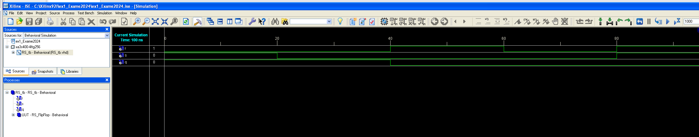

---

### 2. Architecture and Truth Table

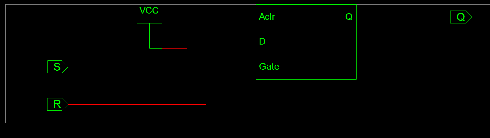

---

### 3. Timing Diagram

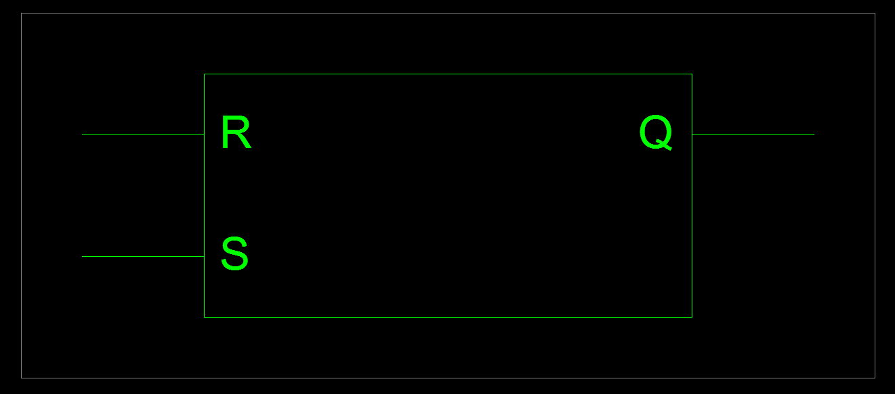

---

## Tools Used

* VHDL
* ModelSim / Vivado / Quartus
* Digital Logic Simulation

---

## Objective

The main goal of this exercise is to learn:

* Basic VHDL syntax
* Sequential logic design
* RS Flip-Flop operation
* Simulation and waveform analysis

---

# 3-Bit Counter in VHDL

## Description

This exercise presents the implementation of a 3-bit binary counter using the VHDL language.

The counter increments its value on each rising edge of the clock signal (`clk`).
A reset signal is also used to initialize the counter value to `000`.

The output `q` represents the current binary value of the counter.

---

## VHDL Code

```vhdl
library IEEE;
use IEEE.STD_LOGIC_1164.ALL;
use IEEE.STD_LOGIC_ARITH.ALL;
use IEEE.STD_LOGIC_UNSIGNED.ALL;

entity Compteur3Bit is
    Port (
        clk   : in STD_LOGIC;
        reset : in STD_LOGIC;
        q     : out STD_LOGIC_VECTOR (2 downto 0)
    );
end Compteur3Bit;

architecture Behavioral of Compteur3Bit is
    signal count : STD_LOGIC_VECTOR (2 downto 0) := "000";
begin
    process (clk, reset)
    begin
        if reset = '1' then
            count <= "000";
        elsif rising_edge(clk) then
            count <= count + 1;
        end if;
    end process;

    q <= count;
end Behavioral;
```

---

## Project Content

This project contains:

* The VHDL **Entity**
* The VHDL **Architecture**
* The simulation **Waveform**
* The counter execution results

---

## Results

### 1. Entity of 3-Bit Counter


---

### 2. Architecture of 3-Bit Counter

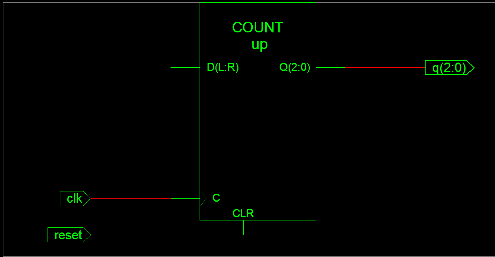

---

### 3. Timing Diagram / Simulation Result

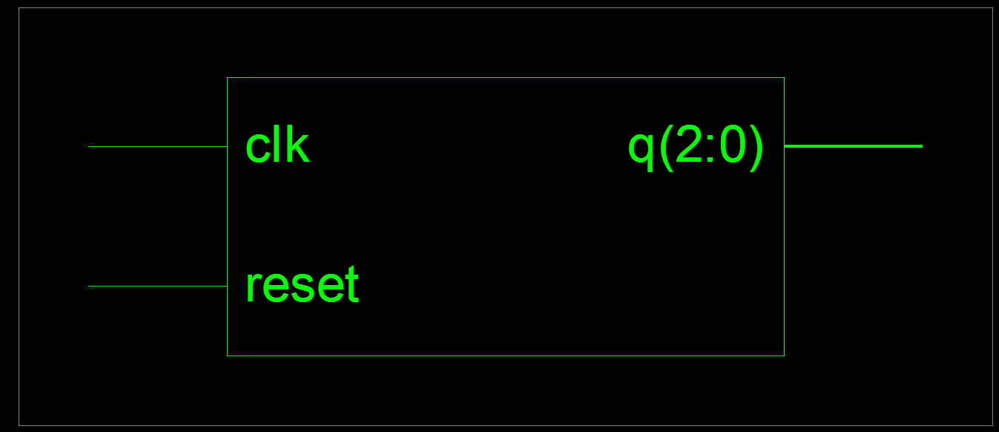

---

## Counter Operation

The counter sequence is:

```text
000 → 001 → 010 → 011 → 100 → 101 → 110 → 111
```

After reaching `111`, the counter returns to `000`.

---

## Tools Used

* VHDL
* ModelSim / Vivado / Quartus
* Digital Logic Simulation

---

## Objective

The objective of this exercise is to learn:

* Sequential circuit design
* Clock signal handling
* Binary counting in VHDL
* Simulation and timing analysis

---

# Quiz Game Circuit in VHDL

## Description

This exercise presents the design of a digital circuit for a quiz game using the VHDL language.

The system contains:

* 3 participants
* 3 push buttons
* 3 lamps
* 1 reset button controlled by the host

Each participant can press their button to answer the question.
The first participant who presses their button activates their corresponding lamp.

Once a participant wins:

* the selected lamp remains ON
* all other buttons become disabled
* no other participant can answer

The system returns to the initial state only when the host presses the `reset` button.

---

## System Operation

### Initial State

* All lamps are OFF
* All buttons are active

### During the Game

* The first pressed button is detected
* The corresponding lamp turns ON
* Other buttons are ignored

### Reset State

* All lamps turn OFF
* The system becomes ready for a new question

---

## Project Content

This project contains:

* The VHDL **Entity**
* The VHDL **Architecture**
* The circuit **Simulation**
* The **Timing Diagram**
* The game execution results

---

## Inputs and Outputs

### Inputs

* `btn1` : Button of participant 1
* `btn2` : Button of participant 2
* `btn3` : Button of participant 3
* `reset` : Reset button

### Outputs

* `lamp1` : Lamp of participant 1
* `lamp2` : Lamp of participant 2
* `lamp3` : Lamp of participant 3

---

## Results

### 1. Entity of Quiz Game Circuit

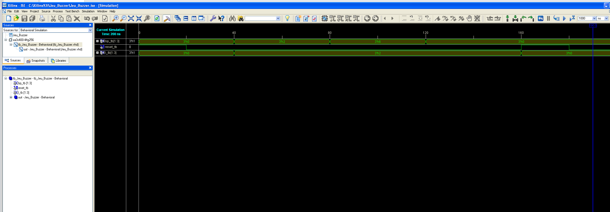

---

### 2. Architecture of the Circuit

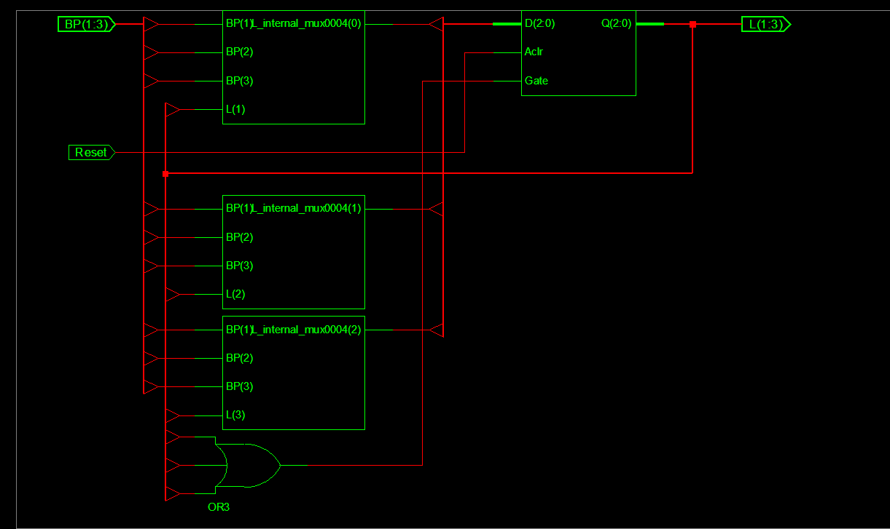

---

### 3. Timing Diagram / Simulation Result

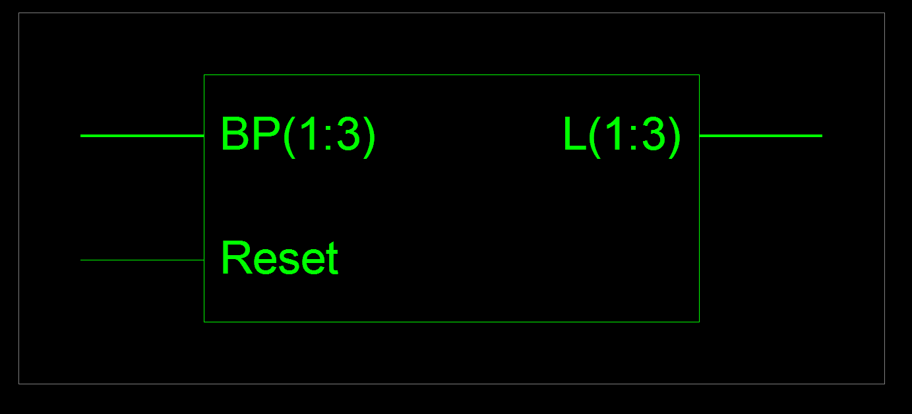

---

## Example Scenario

```text
- Participant 2 presses first
- Lamp 2 turns ON
- Buttons 1 and 3 are disabled
- The system waits for reset
- After reset, all lamps turn OFF
```

---

## Tools Used

* VHDL
* ModelSim / Vivado / Quartus
* Digital Logic Simulation

---

## Objective

The objective of this exercise is to learn:

* Event detection in digital systems
* Sequential logic design
* Priority management
* State control using reset signals
* Simulation and waveform analysis
# VHDL Digital Circuits Projects

# D Flip-Flop with Asynchronous Reset

## Description

This exercise presents the implementation of a D Flip-Flop with asynchronous reset using the VHDL language.

The circuit stores the value of input `D` on the rising edge of the clock signal `CLK`.

The reset signal `RST_N` is asynchronous and active at logic `0`.
When reset is activated, the output `Q` becomes `0` immediately.

---

## VHDL Code

```vhdl id="r08te0"
LIBRARY IEEE;
USE IEEE.STD_LOGIC_1164.ALL;

ENTITY D_FF_ASYNC_RESET IS
    PORT (
        D     : IN  STD_LOGIC;
        CLK   : IN  STD_LOGIC;
        RST_N : IN  STD_LOGIC;
        Q     : OUT STD_LOGIC
    );
END ENTITY D_FF_ASYNC_RESET;

ARCHITECTURE BEHAVIORAL OF D_FF_ASYNC_RESET IS
BEGIN
    PROCESS (CLK, RST_N)
    BEGIN
        IF RST_N = '0' THEN
            Q <= '0';
        ELSIF RISING_EDGE(CLK) THEN
            Q <= D;
        END IF;
    END PROCESS;
END ARCHITECTURE BEHAVIORAL;
```

---

## Project Content

This project contains:

* The VHDL **Entity**
* The VHDL **Architecture**
* The simulation **Waveform**
* The timing diagram results

---

## Results

### 1. Entity of D Flip-Flop

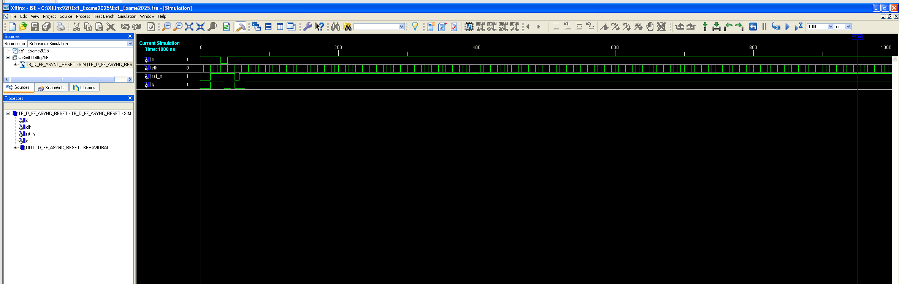

---

### 2. Architecture of D Flip-Flop

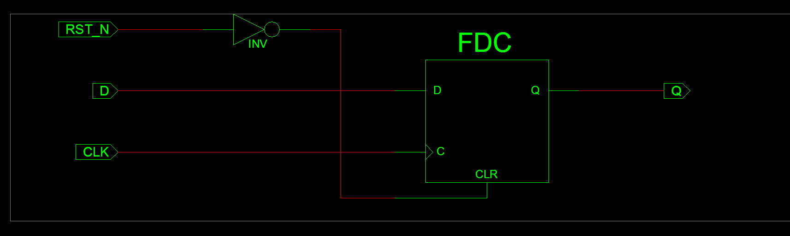

---

### 3. Timing Diagram

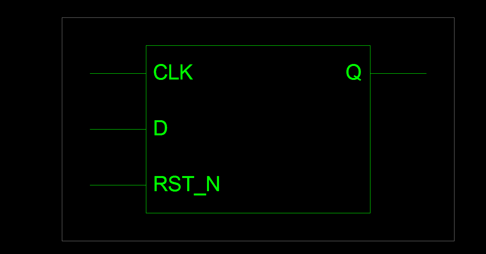

---

## Tools Used

* VHDL
* ModelSim / Vivado / Quartus
* Digital Logic Simulation

---

## Objective

The objective of this exercise is to learn:

* Sequential logic circuits
* Clock edge detection
* Asynchronous reset handling
* D Flip-Flop operation
* Timing simulation analysis

---

# 4-Bit ALU in VHDL

## Description

This exercise presents the implementation of a 4-bit Arithmetic Logic Unit (ALU) using VHDL.

The ALU performs different arithmetic and logical operations according to the selection signal `SEL`.

---

## Supported Operations

| SEL | Operation |
| --- | --------- |
| 00  | A + B     |
| 01  | A - B     |
| 10  | A AND B   |
| 11  | A OR B    |

---

## VHDL Code

```vhdl id="3v6mnd"
library IEEE;
use IEEE.STD_LOGIC_1164.ALL;
use IEEE.STD_LOGIC_UNSIGNED.ALL;

entity ALU_4bits is
    Port (
        A   : in  STD_LOGIC_VECTOR(3 downto 0);
        B   : in  STD_LOGIC_VECTOR(3 downto 0);
        SEL : in  STD_LOGIC_VECTOR(1 downto 0);
        Y   : out STD_LOGIC_VECTOR(3 downto 0)
    );
end ALU_4bits;

architecture comportement of ALU_4bits is
begin
    process(A, B, SEL)
    begin
        case SEL is
            when "00" => Y <= A + B;
            when "01" => Y <= A - B;
            when "10" => Y <= A and B;
            when others => Y <= A or B;
        end case;
    end process;
end comportement;
```

---

## Project Content

This project contains:

* The VHDL **Entity**
* The ALU **Architecture**
* The operation simulation
* The timing diagram results

---

## Results

### 1. Entity of ALU

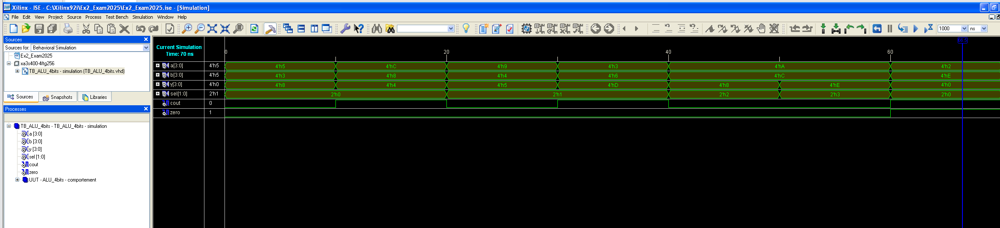

---

### 2. Architecture of ALU

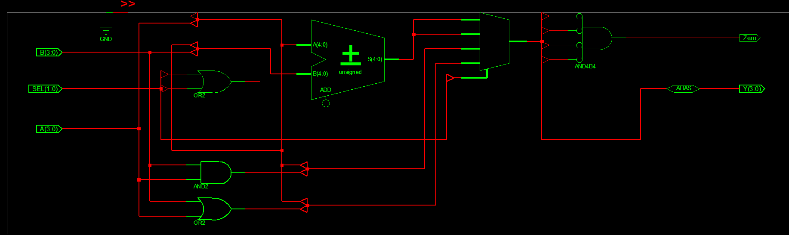

---

### 3. Timing Diagram / Simulation Result

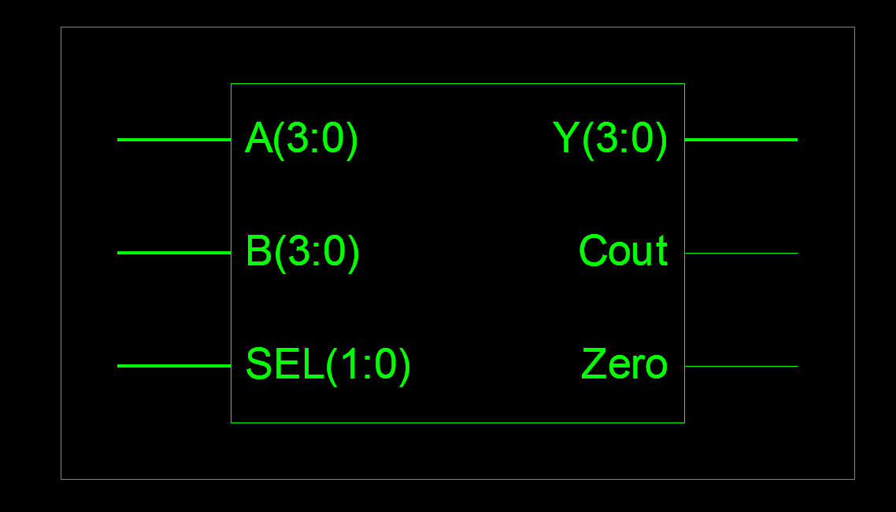

---

## Tools Used

* VHDL
* ModelSim / Vivado / Quartus
* Digital Logic Simulation

---

## Objective

The objective of this exercise is to learn:

* Arithmetic operations in VHDL
* Logical operations implementation
* Case statement usage
* ALU architecture design
* Digital system simulation

---

# Traffic Light Control System

## Description

This exercise presents the design of a traffic light control system using VHDL.

The system manages two main roads using tricolor traffic lights:

* Red Light → 10 seconds
* Orange Light → 3 seconds
* Green Light → 7 seconds

The controller changes the traffic light states automatically according to the timing sequence.

---

## System Operation

### Road 1

* Green for 7 seconds
* Orange for 3 seconds
* Red for 10 seconds

### Road 2

* Red while Road 1 is active
* Green when Road 1 becomes red
* Alternating traffic management

---

## Project Content

This project contains:

* The VHDL **Entity**
* The VHDL **Architecture**
* The timing control logic
* The simulation waveform
* The traffic light sequence results

---

## Results

### 1. Entity of Traffic Light System

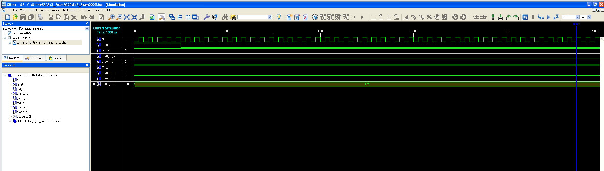

---

### 2. Architecture of Traffic Light System

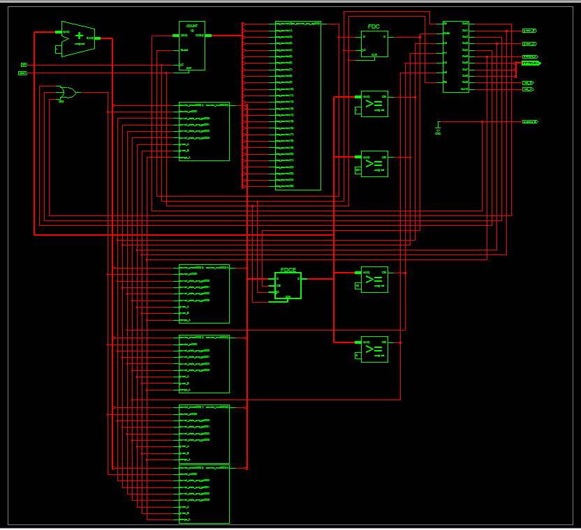

---

### 3. Timing Diagram / Simulation Result

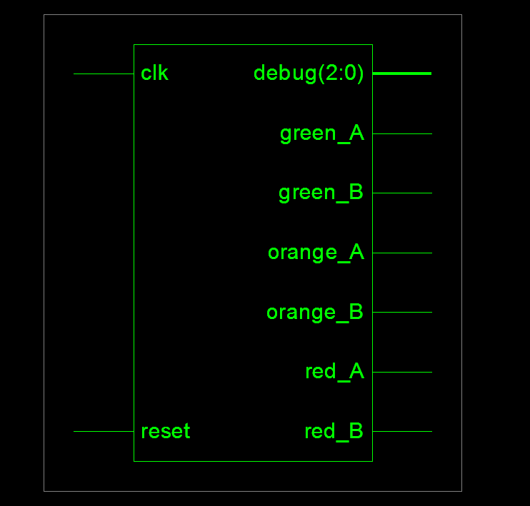

---

## Traffic Light Sequence

```text id="lk9u6d"
Road 1: Green → Orange → Red
Road 2: Red → Green → Orange
```

The cycle repeats continuously.

---

## Tools Used

* VHDL
* ModelSim / Vivado / Quartus
* Digital Logic Simulation

---

## Objective

The objective of this exercise is to learn:

* Finite State Machine (FSM) design
* Timing management in digital systems
* Traffic control automation
* Sequential system implementation
* Simulation and verification

## 📑 Table of Contents

* [RS Flip-Flop in VHDL](#rs-flip-flop-in-vhdl)
* [3-Bit Counter in VHDL](#3-bit-counter-in-vhdl)
* [Quiz Game Circuit in VHDL](#quiz-game-circuit-in-vhdl)
* [D Flip-Flop with Asynchronous Reset](#d-flip-flop-with-asynchronous-reset)
* [4-Bit ALU in VHDL](#4-bit-alu-in-vhdl)
* [Traffic Light Control System](#traffic-light-control-system)
* [Cascadable N-Bit Comparator](#cascadable-n-bit-comparator)

---

# Cascadable N-Bit Comparator

## Description

This advanced project presents the implementation of a Cascadable N-Bit Comparator using the VHDL language.

The comparator is designed to compare two binary numbers `a` and `b` of configurable width `N`.

The system supports cascading between multiple comparator blocks, allowing the comparison of very large binary numbers by connecting several comparator slices together.

---

## Features

* Generic configurable width (`N`)
* Equality comparison
* Greater-than comparison
* Less-than comparison
* Cascading support between comparator stages
* Modular digital design

---

## VHDL Code

```vhdl id="u2czl4"
LIBRARY ieee;

USE ieee.std_logic_1164.ALL;
USE ieee.numeric_std.ALL;

ENTITY CascadableNbitComparator IS

GENERIC (
    N : INTEGER := 8 -- width of this slice
);

PORT (
    a, b : IN STD_LOGIC_VECTOR(N - 1 DOWNTO 0);

    eq_in : IN STD_LOGIC;
    gt_in : IN STD_LOGIC;
    lt_in : IN STD_LOGIC;

    eq_out : OUT STD_LOGIC;
    gt_out : OUT STD_LOGIC;
    lt_out : OUT STD_LOGIC
);

END CascadableNbitComparator;

ARCHITECTURE Behavioral OF CascadableNbitComparator IS

SIGNAL a_unsigned : unsigned(N - 1 DOWNTO 0);
SIGNAL b_unsigned : unsigned(N - 1 DOWNTO 0);

SIGNAL eq_self : STD_LOGIC;
SIGNAL gt_self : STD_LOGIC;
SIGNAL lt_self : STD_LOGIC;

BEGIN

a_unsigned <= unsigned(a);
b_unsigned <= unsigned(b);

-- Compare within this slice
eq_self <= '1' WHEN a_unsigned = b_unsigned ELSE '0';

gt_self <= '1' WHEN a_unsigned > b_unsigned ELSE '0';

lt_self <= '1' WHEN a_unsigned < b_unsigned ELSE '0';

-- Cascade logic
eq_out <= eq_in AND eq_self;

gt_out <= gt_self OR (eq_self AND gt_in);

lt_out <= lt_self OR (eq_self AND lt_in);

END Behavioral;
```

---

## Project Content

This project contains:

* The VHDL **Entity**
* The comparator **Architecture**
* Cascading logic implementation
* Simulation waveform
* Comparator execution results

---

## Inputs and Outputs

### Inputs

* `a` : First binary number
* `b` : Second binary number
* `eq_in` : Equality input from lower comparator stage
* `gt_in` : Greater-than input from lower comparator stage
* `lt_in` : Less-than input from lower comparator stage

### Outputs

* `eq_out` : Equality output
* `gt_out` : Greater-than output
* `lt_out` : Less-than output

---

## Results


### 1. Architecture of Comparator

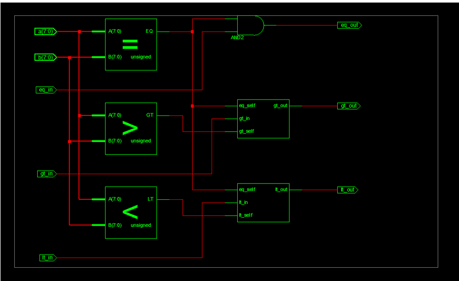

---

### 2. Timing Diagram / Simulation Result

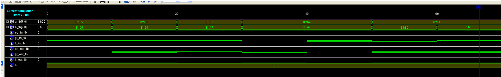

---

## Comparator Logic

```text id="50v0k4"
a = b  → eq_out = 1
a > b  → gt_out = 1
a < b  → lt_out = 1
```

The comparator can be connected with additional comparator blocks to compare larger binary values.

---

## Tools Used

* VHDL
* ModelSim / Vivado / Quartus
* Digital Logic Simulation

---

## Objective

The objective of this project is to learn:

* Generic design in VHDL
* Comparator architecture
* Cascading digital circuits
* Modular hardware design
* Binary comparison systems
* Simulation and verification
